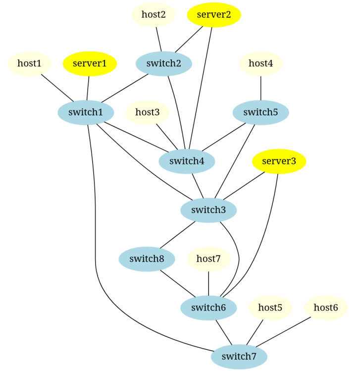

# Network Slice Setup Optimization
Example project of how RYU-controller can be used to perform the network slicing and enable server migration.

## Setup
Install the [ComNetsEmu](https://www.granelli-lab.org/researches/relevant-projects/comnetsemu-labs) virtual machine.
Launch the terminal on ComNetsEmu, copy the files of the project (in the VM) and execute the following commands.
Launch the RYU controller.

!!! build.sh delete all docker containers present in the VM
```bash
chmod +x build.sh
./build.sh
```
On another terminal execute the following command:
```bash
sudo python3 network.py
```
It will launch the choice of the topology and the Mininet script.

## Logs
To see logs of the "server1":
```bash
sudo docker logs counter_server1
```
To see logs of the client launched on the "host5":
```bash
sudo docker logs client_host5
```
To see all launched containers run:
```bash
sudo docker ps -a
```

## Terminate
```
mininet> exit
```
Ctrl-C for RYU controller

Note: please exit from mininet before relaunching the script *build.sh* because it can cause problem

## Predefined topology


## Example 

## Authors
- Dao Simone
- Grilli Filippo
- Sabel Petr

## Presentation
The presentation of the project can be found [here](https://docs.google.com/presentation/d/1VXc0LBdj-TX0rqI6N3wFmcdcHd6BWXbW_dYA5rOOeaA/edit?usp=sharing)